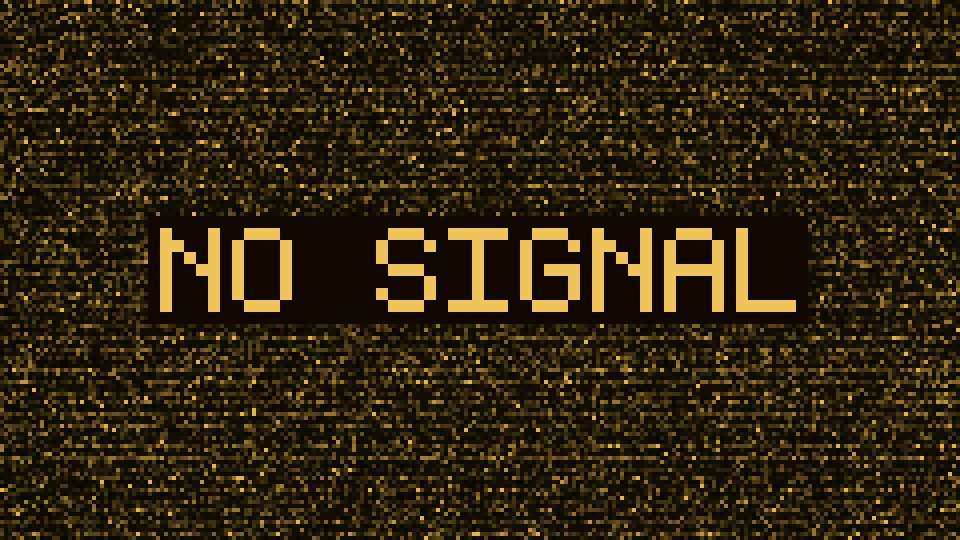
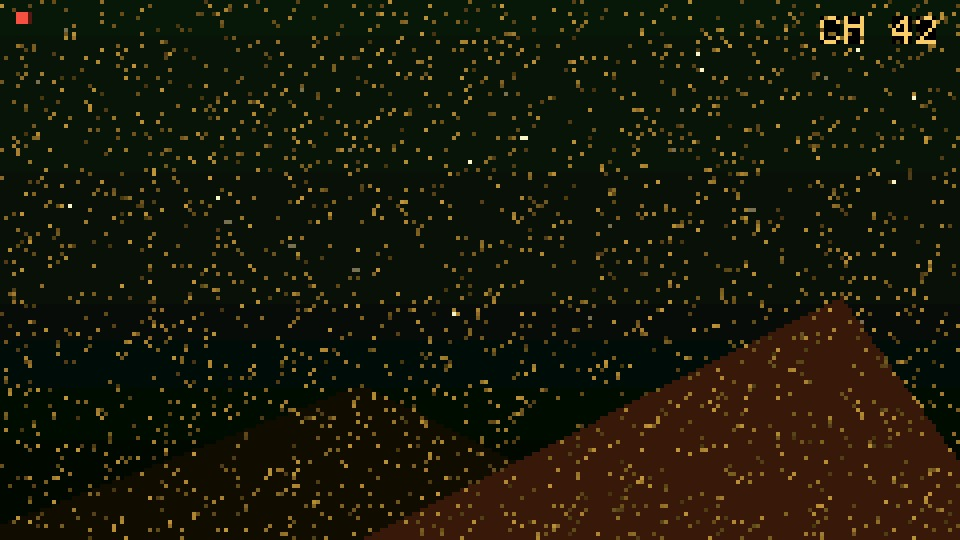

# NO SIGNAL — 迷你静电电视 / Mini Static-Noise TV (M5StickS3)

**中文** · [English](README.md)

**一块 240×135 的显像管，永远停在那个没有信号的频道。** 琥珀磷光雪花缓缓呼吸，常驻的 `NO SIGNAL` 招牌，3,864 种故障场景（14 雪花 × 12 文字 × 23 扭曲）——**拍它一下**：一半概率从雪花深处锁定出一个伪世界频道（38 个主体，每个都配自己的声音），一半概率抖落两根亮扫描线。闲置五分钟，它自己悄悄变成一只时钟。

> *不是屏保，是一件"总是差一点就坏"的小家电。*

| 常态：琥珀雪花 + `NO SIGNAL` 招牌 | 锁定频道：台标 `CH 42` |
|---|---|
|  |  |

*两张都是 v0.1.0 版**真机帧缓冲截图**（4 倍最近邻放大），不是摄影——真机在暗房里比这更暖、更暗。*

---

## 它是什么

桌面氛围摆件，也是失眠时的白噪音 + 凝视伙伴。两个按键、没有菜单、没有配置文件：它的一切行为都是同一条长尾概率分布。

| | |
|---|---|
| **雪花引擎（14 变体）** | 粗颗粒 / 细沙 / 上下分段 / 呼吸 / 结块 / 风雪漂移 / 暗场 / 竖条干扰 / 暖红偏色 / 白噪过曝 / 稀疏 / 密集 … |
| **文字招牌（12 变体）** | 打字机显影 / 彩条 / 频道呼号 / 重影 / 上下分裂 / 融化 / 像素碎 / 抖动 / 闪烁 / 持续时钟 / 全乱码 … |
| **画面扭曲（23 变体）** | 行不同步斜纹 / 场不同步上下滚 / 卷边 / 整体抖动 / 天线抖动 / 水波涟漪 / 电子束放电弧 / 桶形枕形 / 镜像 / 拼接 / 缩放 / 负片 / 暗角 / 信箱 / 聚焦漂移 / 多径重影 / 撕裂 / 翻转 / 搜台 / 假关机 / 渐弱 / 黑带 … |
| **故障场景** | **14 × 12 × 23 = 3,864 种**组合，40~150s 随机触发 |
| **特殊事件** | 频道切换 / 信号恢复幻觉 / 电话干扰（真实 DTMF 音）/ 天线松动 / 幽灵广播 / **外星符文灯牌**（20~110s） |
| **呼吸层** | 事件层之下五条互质慢 LFO——亮度呼吸 9s / 暗角游走 41s / 行位移蠕动 83s / 衰老带 197s / 场相位微扰 17s；呼吸深度本身每 25~70s 随机游走，整幅画面还会周期性"来一下就走"或突然病态（60~180s 判定、25% 触发） |
| **拍电视** | 拍一下 → **50% 伪节目 6s / 50% 扫描线**。节目 = 38 主体 × 6 背景 × 12 天体 × 8 台标款式 × 3 质感 × 3×3×3 动态轴 |
| **38 个世界频道** | 自然 14（极光 / 雷暴平原 / 沙丘 …）· 文明奇观 8（金字塔 / 巨石阵 / 长城 / 帕特农 / 吴哥窟 / 富士鸟居 / 石像 / 清真寺）· 神话 4（云龙 / 巨鲸 / 羽蛇神 / 树人）· 科幻 12（独眼巨人 / UFO 母舰 / 航天飞机 / 火箭台 / 卫星 / 月球基地 / 外星城市 / 机器人 / 着陆器 / 方碑 / 空间站 / 图腾柱） |
| **去重记忆** | 主体最近 4 拍不重、背景 2、天体 2——池子比手感大得多 |
| **节目内稀有事件** | 20% 概率：Philips 测试卡 / 全屏彩条 / 灰度阶梯 / TELETEXT / 马赛克 / 外星字母表 / 信号倒放 / 辐射风暴；更稀的彩蛋池另算 |
| **声学轴** | 22kHz 白噪引擎，音量随画面故障动态联动（假关机静音+砰声 / 亮噪爆响 / 渐弱同步衰减 / 搜台扫频音）。每个主体类另有专属事件音：**盖革稀疏**（自然/文明）、**盖革密集**（科幻）、**外星数字语拨号**（神话）、**摩尔斯 SOS**、**机械嗡+噼啪**；锁定时先来一梭子密集盖革，节目结束戛然静默 |
| **省电=时钟** | 闲置 5 分钟 → 大字 HH:MM 时钟、**1fps + 帧间 Light Sleep**、IMU 与音频硬件关闭；按任意键 <100ms 唤醒。**插 USB 供电刻意永不省电** |
| **对时** | 首次开机（或启动页按 A）进 AP + 屏上二维码页；手机连上后打开 `http://192.168.4.1/` 提交时间。**按 A 或 B 立即跳过**，或等 60s |
| **开机过场** | 黑屏 → 中间一道亮线 → 展开成雪花 |

## 现状（哪些真的能用）

| 模块 | 状态 | 说明 |
|---|---|---|
| 雪花引擎 + 故障池 | ✅ 可用 | 3,864 组合、40~150s 一次、按设计不重复 |
| 呼吸层 | ✅ 可用 | 五条互质周期；可用数值验证（见下） |
| 拍出节目 | ✅ 可用 | BMI270、1.8g、双帧确认、3s 冷却防连拍 |
| 声学轴 | ✅ 可用 | v0.1.0 把 v0.0.16 里四档死代码真正接上了线 |
| 台标 / 呼号 | ✅ 可用 | 依赖 v0.1.0 补的 7 个字模（`H W P Q X Z K`）——此前 `CH 5` 会显示成 `C 5` |
| 省电时钟 | ✅ 可用 | 5 分钟 → 1fps + Light Sleep，`BtnA`/`BtnB` GPIO 唤醒；插电豁免 |
| 亮度记忆 | ✅ 可用 | 6 档（5/10/30/50/80/100%），写入 NVS |
| 对时 | ⚠️ 手动 | 只有 AP + 二维码页——没有触摸屏，设备上没法做真正的配置界面；可跳过 |
| 声音调校 | ⚠️ 主观 | 按主体类别分档，除静音键外没有音量控制 |
| OTA 升级 | ❌ 未做 | 只能 USB / M5Burner 刷写 |
| 配置文件 / SD 卡 | ❌ 未做 | 所有概率都写在固件里 |

## 硬件

| | |
|---|---|
| 板子 | **M5Stack StickS3** — ESP32-S3，8MB flash，8MB 八线 PSRAM |
| 屏幕 | 1.14″ 240×135 ST7789（横屏），绘制进 `LGFX_Sprite` 双缓冲 |
| 传感器 | BMI270 IMU（拍打）、ES8311 音频编解码（白噪） |
| 按键 | `BtnA`（左，GPIO11）· `BtnB`（右，GPIO12） |
| 供电 | 内置 250mAh 电池 + USB-C |

### 操作

| 动作 | 功能 |
|---|---|
| **拍一下设备** | 50% 伪节目 6s / 50% 扫描线；节目进行中再拍 = 切下一个频道（3s 冷却） |
| **B 键** | 亮度 5 / 10 / 30 / 50 / 80 / 100%（立即写 NVS） |
| **A 键**（应用界面） | 静音开关键 |
| **A 键**（启动页前 3s） | 进入扫码对时页 |
| **A / B 键**（省电中） | 唤醒——仅此而已：那一次按键被刻意吞掉，不会顺带静音或切亮度 |

## 快速开始

```bash
git clone https://github.com/andjiang0083/no-signal.git
cd no-signal
pio run -e sticks3-prod                 # 发布版（无 WiFi / 无 harness / 无凭据）
pio run -e sticks3-prod -t upload       # USB 刷写
```

下载模式：按住 **KEY1（BtnA）** 的同时点一下背面 **RST**，然后刷写。
开发版、测试 harness、故障对照表都在 [BUILDING_CN.md](BUILDING_CN.md)。

### 不用工具链（M5Burner）

从 Releases 页取 `no-signal-v0.1.0-merged.bin` → M5Burner → **Custom** → **Import Custom FW** 导入
（也可以导入 `m5burner/` 里的 `no-signal.json` 清单）。
**必须用 *merged* 全镜像**：M5Burner 固定从 flash 偏移 0x0 烧录，app-only 的 `no-signal-v0.1.0.bin`
这样烧进去起不来（它是给 `esptool`/OTA 用的）。

```bash
shasum -a 256 -c no-signal-v0.1.0-merged.bin.sha256      # da6bea2d…712b12
```

## 画面是怎么生成的

仓库里**没有任何图像数据**——没有位图、没有精灵表、没有 GIF。每一帧都是运行时生成进 240×135 的 RGB565 缓冲：

1. **雪花**是衰减的磷光场（`g_phos`），每帧注入新点；14 个变体改的是注入率、衰减曲线和调色板坡度。
2. **招牌**用手绘 37 字模 5×7 点阵字体直写帧缓冲（不走 `drawString`——那会把坐标变换叠加两次）。
3. **扭曲**是整帧后处理（23 种）：行位移、场滚动、卷边、涟漪、放电弧、桶形枕形、镜像、拼接、缩放、负片、暗角、信箱、重影、撕裂、假关机…
4. **呼吸层**再调制一层：亮度包络、游走暗角、行蠕动、衰老带、场相位微扰——周期互质，画面永不回环。
5. **伪节目**同路生成：图元库（`prog_shapes.h`）+ 各主体剪影例程，然后台标，然后声音。

每帧用 `pushSprite` 一次性推屏（原子、无撕裂），15fps——省电时钟态 1fps。

## 为什么这个仓库没有单元测试

因为它有意思的部分是一块 240×135 的画面和一只喇叭。开发闭环用的是**只存在于 dev 版**
（`pio run -e sticks3`）的远程测试 harness：一个 HTTP 服务，能把**真实帧缓冲**当 BMP 取出、注入按键、
用 JSON 把随机数钉死成某一个场景 / 某个台标 / 某种扭曲 / 某档声音。PC 端是 `tools/control.py`。

v0.1.0 就是这么验的：修好的"雪花呼吸"是连拍 16 帧、证明整帧平均亮度起伏 3.0（修前 0.5）；
修好的"强撕裂"是往画面里画确定性白点、量出上下两带各偏移 −20px / +12px。
所有数字都写在 [`docs/VERIFY-v0.1.0.md`](docs/VERIFY-v0.1.0.md)，引发这批修订的走查报告是
[`docs/CODE-REVIEW-v0.0.16.md`](docs/CODE-REVIEW-v0.0.16.md)（18 条：P0×1 / P1×8 / P2×9）。

串口调试**刻意不是**这里的开发方式：省电走 Light Sleep 会断开 USB CDC，背光变化又根本不进帧缓冲——
这套固件有很大一部分在串口上是看不见的。

## 已知限制

- **没有触摸屏，只有两个按键**——这个约束贯穿了项目里每一个交互决定。
- **没有 OTA、没有配置文件**：想改一个概率就得改固件。
- **时钟拿到什么时间就是什么时间**（对时那一次手机提交的值），存在 RTC 里。
- **声音是 22kHz 白噪引擎 + 音调叠加**，不是采样播放器；音色刻意是合成的。
- 调色板只有琥珀一色，你能看到的一切不是图元就是字形。

## 参与贡献

非常欢迎贡献——尤其是新的世界主体、新的扭曲、新的声音点子。先读
[CONTRIBUTING_CN.md](CONTRIBUTING_CN.md)：这个项目偏好"在已验证代码上做小改动"、偏好可证伪的验证方式，
且**源码注释是中文**（作者母语），规则值得花五分钟。
[ROADMAP_CN.md](ROADMAP_CN.md) 列了具体待办，包括 v0.0.16 走查给出的三项性能/重构任务。

## 致谢与许可

- 随仓库携带：[`src/qrcode.h`](src/qrcode.h) — MIT，© 2017 Richard Moore 与 © 2017 Project Nayuki。
- 构建依赖：M5Unified / M5GFX（MIT，M5Stack）、Arduino-ESP32（LGPL-2.1，乐鑫）、
  ESP-IDF（Apache-2.0，乐鑫）、PlatformIO（Apache-2.0）。
- 其余全部——引擎、美术、字模、配色、声音设计——均为本仓库原创。
- 完整第三方声明见 [CREDITS.md](CREDITS.md)。

**许可：MIT**（见 [LICENSE](LICENSE)）— © 2026 andjiang0083。

M5Stack / StickS3 / ESP32 是各自所有者的商标。本项目与 M5Stack 无隶属关系，未获其背书。
